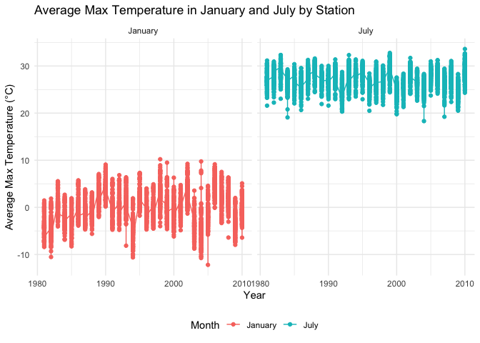
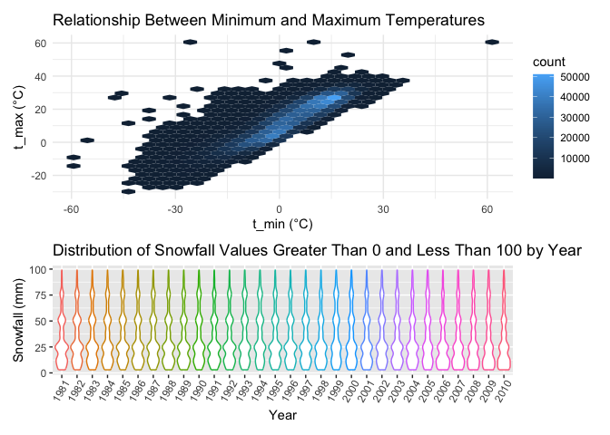
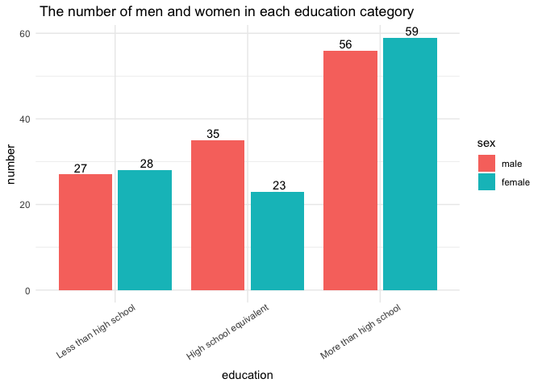
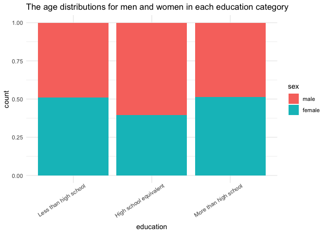
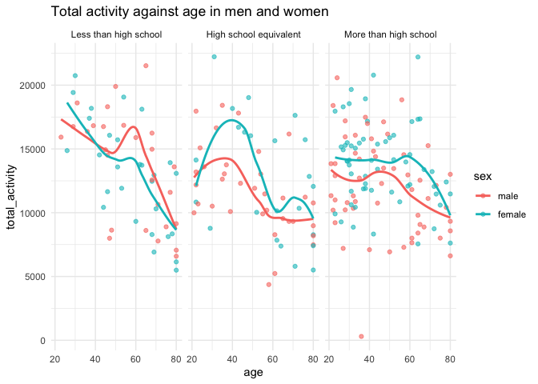
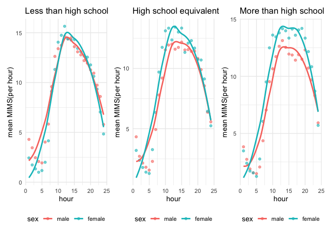
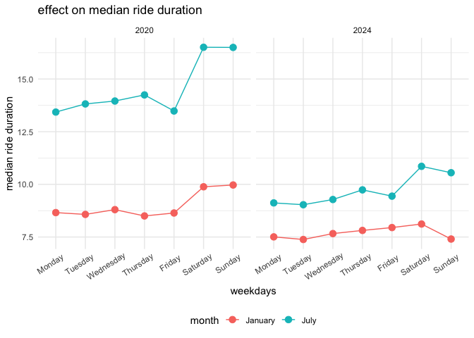
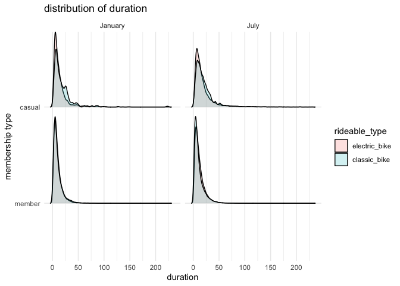
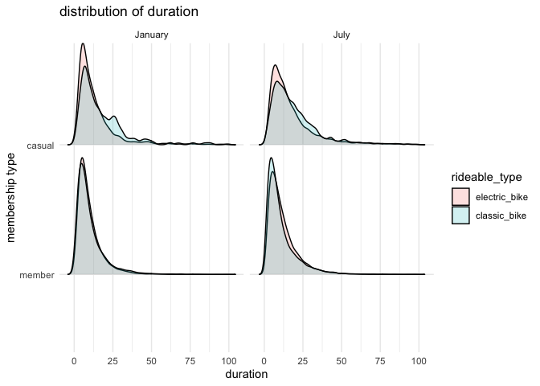

p8105_hw3_zl3544
================
2024-10-14

# Problem 1

## Exploration of the dataset

``` r
# Display the structure of the dataset
str(ny_noaa)
```

    ## tibble [2,595,176 × 7] (S3: tbl_df/tbl/data.frame)
    ##  $ id  : chr [1:2595176] "US1NYAB0001" "US1NYAB0001" "US1NYAB0001" "US1NYAB0001" ...
    ##  $ date: Date[1:2595176], format: "2007-11-01" "2007-11-02" ...
    ##  $ prcp: int [1:2595176] NA NA NA NA NA NA NA NA NA NA ...
    ##  $ snow: int [1:2595176] NA NA NA NA NA NA NA NA NA NA ...
    ##  $ snwd: int [1:2595176] NA NA NA NA NA NA NA NA NA NA ...
    ##  $ tmax: chr [1:2595176] NA NA NA NA ...
    ##  $ tmin: chr [1:2595176] NA NA NA NA ...
    ##  - attr(*, "spec")=
    ##   .. cols(
    ##   ..   id = col_character(),
    ##   ..   date = col_date(format = ""),
    ##   ..   prcp = col_integer(),
    ##   ..   snow = col_integer(),
    ##   ..   snwd = col_integer(),
    ##   ..   tmax = col_character(),
    ##   ..   tmin = col_character()
    ##   .. )

``` r
# Get the number of rows and columns
nrow(ny_noaa)
```

    ## [1] 2595176

``` r
ncol(ny_noaa)
```

    ## [1] 7

``` r
# Display the dimensions of the dataset
dim(ny_noaa)
```

    ## [1] 2595176       7

``` r
# Show the structure again for a detailed overview
str(ny_noaa)
```

    ## tibble [2,595,176 × 7] (S3: tbl_df/tbl/data.frame)
    ##  $ id  : chr [1:2595176] "US1NYAB0001" "US1NYAB0001" "US1NYAB0001" "US1NYAB0001" ...
    ##  $ date: Date[1:2595176], format: "2007-11-01" "2007-11-02" ...
    ##  $ prcp: int [1:2595176] NA NA NA NA NA NA NA NA NA NA ...
    ##  $ snow: int [1:2595176] NA NA NA NA NA NA NA NA NA NA ...
    ##  $ snwd: int [1:2595176] NA NA NA NA NA NA NA NA NA NA ...
    ##  $ tmax: chr [1:2595176] NA NA NA NA ...
    ##  $ tmin: chr [1:2595176] NA NA NA NA ...
    ##  - attr(*, "spec")=
    ##   .. cols(
    ##   ..   id = col_character(),
    ##   ..   date = col_date(format = ""),
    ##   ..   prcp = col_integer(),
    ##   ..   snow = col_integer(),
    ##   ..   snwd = col_integer(),
    ##   ..   tmax = col_character(),
    ##   ..   tmin = col_character()
    ##   .. )

``` r
# Provide a summary of the dataset
summary(ny_noaa)
```

    ##       id                 date                 prcp               snow       
    ##  Length:2595176     Min.   :1981-01-01   Min.   :    0.00   Min.   :  -13   
    ##  Class :character   1st Qu.:1988-11-29   1st Qu.:    0.00   1st Qu.:    0   
    ##  Mode  :character   Median :1997-01-21   Median :    0.00   Median :    0   
    ##                     Mean   :1997-01-01   Mean   :   29.82   Mean   :    5   
    ##                     3rd Qu.:2005-09-01   3rd Qu.:   23.00   3rd Qu.:    0   
    ##                     Max.   :2010-12-31   Max.   :22860.00   Max.   :10160   
    ##                                          NA's   :145838     NA's   :381221  
    ##       snwd            tmax               tmin          
    ##  Min.   :   0.0   Length:2595176     Length:2595176    
    ##  1st Qu.:   0.0   Class :character   Class :character  
    ##  Median :   0.0   Mode  :character   Mode  :character  
    ##  Mean   :  37.3                                        
    ##  3rd Qu.:   0.0                                        
    ##  Max.   :9195.0                                        
    ##  NA's   :591786

### Description of the dataset

The dataset have 2595176 and 7 columns, which means that the ny_noaa
dataset has 2,595,176 observations and 7 variables. The variables
includes: id(Weather station identifier),date(Date of the observation),
prcp(Precipitation (tenths of mm)), snow(Snowfall (mm)), snwd(Snow depth
(mm)),tmax(Maximum temperature (tenths of degrees C)), tmin(Minimum
temperature (tenths of degrees C)). In the summary, we can see that:
prcp has a mean 29.82, the min is 0 and the max is 22860; snow has a
mean 5, the min is -13 and the max is 10160; snwd has a mean 37.3, the
min is 0 and the max is 9195. Also， there are missing value in some
variables.

### Missing data

Caculate the percentage of missing data:

``` r
ny_noaa %>%
  summarise(
    missing_prcp = mean(is.na(prcp)) * 100,
    missing_snow = mean(is.na(snow)) * 100,
    missing_snwd = mean(is.na(snwd)) * 100,
    missing_tmax = mean(is.na(tmax)) * 100,
    missing_tmin = mean(is.na(tmin)) * 100
  )
```

    ## # A tibble: 1 × 5
    ##   missing_prcp missing_snow missing_snwd missing_tmax missing_tmin
    ##          <dbl>        <dbl>        <dbl>        <dbl>        <dbl>
    ## 1         5.62         14.7         22.8         43.7         43.7

5.62% of prcp values are missing, 14.68% of snow values are
missing,22.80% of snwd values are missing, 43.69% tmax are missing,
46.23% of tmin are missing.

## Data cleaning

``` r
ny_noaa_cleaned= ny_noaa %>%
  janitor::clean_names() %>% 
  mutate(
    year = year(date),
    month = month(date),
    day = day(date),
    prcp = as.numeric(prcp)/10,
    tmax = as.numeric(tmax)/10,
    tmin = as.numeric(tmin)/10
  ) %>% 
  filter(tmax > tmin | is.na(tmax) | is.na(tmin)) %>% 
  filter(!(is.na(snow) & is.na(snwd) & is.na(tmax) & is.na(tmin) & is.na(prcp)))
head(ny_noaa_cleaned)
```

    ## # A tibble: 6 × 10
    ##   id          date        prcp  snow  snwd  tmax  tmin  year month   day
    ##   <chr>       <date>     <dbl> <int> <int> <dbl> <dbl> <dbl> <dbl> <int>
    ## 1 US1NYAB0001 2007-11-17   0.3     3     0    NA    NA  2007    11    17
    ## 2 US1NYAB0001 2007-11-18   0       0    NA    NA    NA  2007    11    18
    ## 3 US1NYAB0001 2007-11-19   0       0     0    NA    NA  2007    11    19
    ## 4 US1NYAB0001 2007-11-20   2.5     0     0    NA    NA  2007    11    20
    ## 5 US1NYAB0001 2007-11-21   7.1     0     0    NA    NA  2007    11    21
    ## 6 US1NYAB0001 2007-11-22   0.8     0    NA    NA    NA  2007    11    22

The data cleaning process:

- Create separate variables for year, month, and day.

- Ensure observations for temperature, precipitation, and snowfall are
  given in reasonable units.

- Ensures that only keep observations where the temperature data makes
  sense (i.e., maximum temperatures are logically higher than minimum
  temperatures)

- Filtered out rows in a dataset where all of the specified variables
  (snow, snwd, tmax, tmin, and prcp) are missing.

### Most common snowfall values:

``` r
ny_noaa_cleaned %>% 
  count(snow) %>% 
  arrange(desc(n)) 
```

    ## # A tibble: 282 × 2
    ##     snow       n
    ##    <int>   <int>
    ##  1     0 2007240
    ##  2    NA  308654
    ##  3    25   30981
    ##  4    13   23082
    ##  5    51   18253
    ##  6    76   10159
    ##  7     8    9959
    ##  8     5    9742
    ##  9    38    9186
    ## 10     3    8786
    ## # ℹ 272 more rows

According to the table, 0 is the most common snowfall value.

## Making plots:

### A two-panel plot showing the average max temperature in January and in July in each station across years

``` r
mean_temps <- ny_noaa_cleaned %>%
  filter(month %in% c(1, 7)) %>%
  group_by(id, year, month) %>%
  summarise(mean_tmax = mean(tmax, na.rm = TRUE), .groups = 'drop') %>%
  mutate(month = if_else(month == 1, "January", "July"))
```

``` r
avg_tmax_plot <- ggplot(mean_temps, aes(x = year, y = mean_tmax, color = month)) +
  geom_point() +            # Add points
  geom_line() +             # Connect points with lines
  facet_grid(.~ month, labeller = labeller(month = c(`1` = "January", `7` = "July"))) +
  labs(title = "Average Max Temperature in January and July by Station",
       x = "Year",
       y = "Average Max Temperature (°C)",
       color = "Month") +
  theme_minimal() +        # Use a minimal theme
  theme(legend.position = "bottom")  # Position the legend

# Display the plot
print(avg_tmax_plot)
```

    ## Warning: Removed 5970 rows containing missing values or values outside the scale range
    ## (`geom_point()`).

<!-- -->

The plot indicates that there are significant differences between the
average max temperature in January and in July. The plot shows mean
maximum temperatures in January below 0°C for many stations, mean
maximum temperatures in July generally around 25°C to 30°C. There are
some outliers in January, for example, the year 2005, it indicates that
the year 2005 is extremely cold in the winter, there are also some
outliers in July. But the temperature in July is always higher than
January. \## Combined plot

``` r
# Hexbin plot for tmax vs tmin
hexbin_plot = ggplot(ny_noaa_cleaned, aes(x = tmin, y = tmax)) + 
  geom_hex() + 
  labs(title = "Relationship Between Minimum and Maximum Temperatures",
       x = "t_min (°C)",
       y = "t_max (°C)")+
  theme_minimal()
```

``` r
# Plot showing the distribution of snowfall values
violin_plot = ny_noaa_cleaned %>% 
  filter(snow > 0 & snow< 100) %>% 
  ggplot(aes(x = as.factor(year), y =snow, color = as.character(year))) + 
  geom_violin()+
  labs(
    x = "Year",
    y = "Snowfall (mm)",
    title = "Distribution of Snowfall Values Greater Than 0 and Less Than 100 by Year"
  ) +
theme(legend.position='none',
        axis.text.x = element_text(angle = 60,vjust = 0.88,hjust = 0.77))
hexbin_plot + violin_plot + plot_layout(heights = c(3,2))
```

    ## Warning: Removed 1063998 rows containing non-finite outside the scale range
    ## (`stat_binhex()`).

<!-- -->

# Problem 2

## Read data

``` r
demo= read_csv('./data/nhanes_covar.csv',na = c("NA", ".", ""), skip = 4) %>% 
  janitor::clean_names()
```

    ## Rows: 250 Columns: 5
    ## ── Column specification ────────────────────────────────────────────────────────
    ## Delimiter: ","
    ## dbl (5): SEQN, sex, age, BMI, education
    ## 
    ## ℹ Use `spec()` to retrieve the full column specification for this data.
    ## ℹ Specify the column types or set `show_col_types = FALSE` to quiet this message.

``` r
accelerometer=read_csv('./data/nhanes_accel.csv', na = c("NA", ".", "")) %>% 
  janitor::clean_names()
```

    ## Rows: 250 Columns: 1441
    ## ── Column specification ────────────────────────────────────────────────────────
    ## Delimiter: ","
    ## dbl (1441): SEQN, min1, min2, min3, min4, min5, min6, min7, min8, min9, min1...
    ## 
    ## ℹ Use `spec()` to retrieve the full column specification for this data.
    ## ℹ Specify the column types or set `show_col_types = FALSE` to quiet this message.

Notice that the accelerometer dataset is not tidy, “min1”,“min2”,…

## Data cleaning

Merge, tidy and clean the data, exclude participants less than 21 years
of age, and those with missing demographic data, and encode data with
reasonable variable classes:

``` r
demo=demo %>% 
  filter(age>=21) %>% 
  drop_na
anti_join(demo, accelerometer, by = "seqn")
```

    ## # A tibble: 0 × 5
    ## # ℹ 5 variables: seqn <dbl>, sex <dbl>, age <dbl>, bmi <dbl>, education <dbl>

``` r
merged_df= left_join(demo, accelerometer, by = "seqn") %>% 
  pivot_longer(
    min1:min1440,
    names_to = "minute",
    values_to = "MIMS"
  ) %>% 
  mutate(
    sex = factor(sex, levels = c(1, 2), labels = c('male','female')),
    education = factor(education, levels = c(1, 2, 3), labels = c('Less than high school','High school equivalent','More than high school')),
    minute = as.numeric(gsub("min", "", minute))
    ) 
head(merged_df)
```

    ## # A tibble: 6 × 7
    ##    seqn sex     age   bmi education              minute  MIMS
    ##   <dbl> <fct> <dbl> <dbl> <fct>                   <dbl> <dbl>
    ## 1 62161 male     22  23.3 High school equivalent      1 1.11 
    ## 2 62161 male     22  23.3 High school equivalent      2 3.12 
    ## 3 62161 male     22  23.3 High school equivalent      3 1.47 
    ## 4 62161 male     22  23.3 High school equivalent      4 0.938
    ## 5 62161 male     22  23.3 High school equivalent      5 1.60 
    ## 6 62161 male     22  23.3 High school equivalent      6 0.145

## Produce a reader-friendly table for the number of men and women in each education category

``` r
count_sex_education=merged_df %>% 
  select(seqn,sex,education) %>% 
  #ensuring that only unique entries are retained
  unique() %>% 
  # will be used to count participants
  mutate(num = 1) %>% 
  # The data is grouped by sex and education, and the total count (number) is calculated for each group
  group_by(sex, education) %>% 
  summarise(number = sum(num), .groups = 'keep')
reader_table= count_sex_education %>% 
  pivot_wider(
    names_from = 'education',
    values_from = 'number'
  )
reader_table
```

    ## # A tibble: 2 × 4
    ## # Groups:   sex [2]
    ##   sex    `Less than high school` `High school equivalent` More than high schoo…¹
    ##   <fct>                    <dbl>                    <dbl>                  <dbl>
    ## 1 male                        27                       35                     56
    ## 2 female                      28                       23                     59
    ## # ℹ abbreviated name: ¹​`More than high school`

Then transformed the table to graph to get a clearer view:

``` r
plot_count_sex_education=merged_df %>% 
  select(seqn,sex,education) %>% 
  #ensuring that only unique entries are retained
  unique() %>% 
  # will be used to count participants
  mutate(num = 1) %>% 
  # The data is grouped by sex and education, and the total count (number) is calculated for each group
  group_by(sex, education) %>% 
  summarise(number = sum(num), .groups = 'keep') %>% 
  ggplot(aes(x = education, y = number))+
  theme_minimal()+
  labs(title=" The number of men and women in each education category")+
  theme(axis.text.x = element_text(angle = 33,vjust = 0.88,hjust = 0.77))+
  geom_col(aes(fill=sex), position = position_dodge2(preserve = 'single')) +
  geom_text(aes(label=number), 
            position = position_dodge2(width = 1, preserve = 'single'), 
            vjust = -0.3, hjust = 0.6)
plot_count_sex_education
```

<!-- -->

The chart shows that: There are more men than women with highschool
equivalent, and more people received more than high school education.

Create a visualization of the age distributions for men and women in
each education category:

``` r
distribution_sex=merged_df %>% 
  select(seqn, sex, education) %>% 
  unique() %>% 
  ggplot(aes(x = education)) +
  geom_bar(aes(fill = sex), position = 'fill')+
  labs(title="The age distributions for men and women in each education category")+
  theme_minimal()+
  theme(axis.text.x = element_text(angle = 33,vjust = 0.88,hjust = 0.77))
distribution_sex
```

<!-- -->

Plot the plot of total activities against age:

``` r
total_activities=merged_df %>% 
  group_by(seqn, age, sex, education) %>% 
  summarise(total_activity = sum(MIMS), .groups = "keep")
ggplot(total_activities, aes(x = age, y = total_activity, color = sex))+
    geom_point(alpha = .6) +
  geom_smooth(se = FALSE) + 
  theme_minimal()+
  facet_grid(. ~ education)+
  labs(
    title = "Total activity against age in men and women",
    x = "age",
    y = "total_activity")
```

    ## `geom_smooth()` using method = 'loess' and formula = 'y ~ x'

<!-- -->

- Females with less than a high school education generally exhibit
  higher levels of activity than males, which is the opposite of the
  trends seen in the other two groups.

- Comparing the groups, both males and females aged 20 to 40 who have
  more than a high school education are less active than their
  counterparts in other educational categories.

- Regarding overall trends, individuals at all educational levels show a
  decline in total activity after around age 60. Those with less than a
  high school education exhibit the highest total activity around age
  20, while individuals with a high school equivalent education peak in
  total activity around age 40.

## Making a three-panel plot

``` r
plot_less=merged_df %>% 
  filter(education=='Less than high school') %>% 
  mutate(hour=ceiling(as.numeric(minute)/60)) %>% 
  group_by(hour, sex) %>% 
  summarise(mean_mims=mean(MIMS), .groups='keep') %>% 
  ggplot(aes(x = hour, y = mean_mims, color = sex))+  
  geom_point(alpha=.6)+
  geom_smooth(method = "loess", se = FALSE) +
  theme_minimal()+
  theme(legend.position='bottom')+
  labs(
    title = "Less than high school",
    x = "hour",
    y = "mean MIMS(per hour)")

plot_high=merged_df %>% 
  filter(education=='High school equivalent') %>% 
  mutate(hour=ceiling(as.numeric(minute)/60)) %>% 
  group_by(hour, sex) %>% 
  summarise(mean_mims=mean(MIMS), .groups='keep') %>% 
  ggplot(aes(x = hour, y = mean_mims, color = sex))+
  geom_point(alpha=.6)+
  geom_smooth(method = "loess", se = FALSE) +
  theme_minimal()+
  theme(legend.position='bottom')+
  labs(
    title = "High school equivalent",
    x = "hour",
    y = "mean MIMS(per hour)")

plot_more=merged_df %>% 
  filter(education=='More than high school') %>% 
  mutate(hour=ceiling(as.numeric(minute)/60)) %>% 
  group_by(hour, sex) %>% 
  summarise(mean_mims=mean(MIMS), .groups='keep') %>% 
  ggplot(aes(x = hour, y = mean_mims, color = sex))+
  geom_point(alpha=.6)+
  geom_smooth(method = "loess", se = FALSE) +
  theme_minimal()+
  theme(legend.position='bottom')+
  labs(
    title = "More than high school",
    x = "hour",
    y = "mean MIMS(per hour)")
plot_less+plot_high+plot_more
```

    ## `geom_smooth()` using formula = 'y ~ x'
    ## `geom_smooth()` using formula = 'y ~ x'
    ## `geom_smooth()` using formula = 'y ~ x'

<!-- -->

Overall, activity levels rises from the first 12 hour of a day, and
reach their highest point around midday for all educational groups,there
is a notable decline in activity during the late evening hours. Women
consistently report higher activity levels than men, particularly in the
“High School Equivalent” and “More than High School” groups.

# Problem 3

Read the data:

``` r
jan_2020=read.csv('./data/citi/Jan 2020 Citi.csv') %>% 
  mutate(month = "January", year = "2020")
jan_2024=read.csv('./data/citi/Jan 2024 Citi.csv') %>% 
  mutate(month = "January", year = "2024")
july_2020=read.csv('./data/citi/July 2020 Citi.csv') %>% 
  mutate(month = "July", year = "2020")
july_2024=read.csv('./data/citi/July 2024 Citi.csv') %>% 
   mutate(month = "July", year = "2024")
```

Merge the datasets together:

``` r
citi_df=bind_rows(jan_2020, jan_2024, july_2020, july_2024) %>% 
  distinct() %>% 
  janitor::clean_names()
head(citi_df)
```

    ##            ride_id rideable_type  weekdays  duration         start_station_name
    ## 1 4BE06CB33B037044  classic_bike   Tuesday 15.333267     Columbus Ave & W 95 St
    ## 2 26886E034974493B  classic_bike Wednesday  5.309467            2 Ave & E 96 St
    ## 3 24DC56060EBE6260  classic_bike    Friday  9.691800 Columbia St & Rivington St
    ## 4 EEDC1053582D02E5  classic_bike    Sunday  6.996183     W 84 St & Columbus Ave
    ## 5 2CD4BD4CEE2E50A9  classic_bike    Friday  2.849500     Forsyth St & Broome St
    ## 6 E18682F9A4E501BB  classic_bike    Sunday 25.523467       Allen St & Hester St
    ##           end_station_name member_casual   month year
    ## 1    E 53 St & Madison Ave        member January 2020
    ## 2         1 Ave & E 110 St        member January 2020
    ## 3  Grand St & Elizabeth St        member January 2020
    ## 4   Columbus Ave & W 72 St        member January 2020
    ## 5  Suffolk St & Stanton St        member January 2020
    ## 6 Atlantic Ave & Furman St        member January 2020

## Total number of rides in each combination of year and month separating casual riders and Citi Bike members

``` r
total_rides_table=citi_df %>% 
  mutate(number=1) %>% 
  group_by(member_casual, year, month) %>% 
  summarise(total_rides = sum(number), .groups = 'keep')
total_rides_table
```

    ## # A tibble: 8 × 4
    ## # Groups:   member_casual, year, month [8]
    ##   member_casual year  month   total_rides
    ##   <chr>         <chr> <chr>         <dbl>
    ## 1 casual        2020  January         984
    ## 2 casual        2020  July           5637
    ## 3 casual        2024  January        2108
    ## 4 casual        2024  July          10894
    ## 5 member        2020  January       11436
    ## 6 member        2020  July          15411
    ## 7 member        2024  January       16753
    ## 8 member        2024  July          36262

## The 5 most popular starting stations for July 2024:

``` r
the_5_starting=citi_df %>% 
  mutate(number=1) %>% 
  filter(month == 'July',year == 2024) %>% 
  group_by(start_station_name) %>% 
  summarise(total_start=sum(number), .groups='keep') %>% 
  arrange(desc(total_start)) %>% 
  head(5)
the_5_starting
```

    ## # A tibble: 5 × 2
    ## # Groups:   start_station_name [5]
    ##   start_station_name       total_start
    ##   <chr>                          <dbl>
    ## 1 Pier 61 at Chelsea Piers         163
    ## 2 University Pl & E 14 St          155
    ## 3 W 21 St & 6 Ave                  152
    ## 4 West St & Chambers St            150
    ## 5 W 31 St & 7 Ave                  146

The number of member riders are larger compared to casual members in
general. The total numbers of casual riders riding in 2020 January, 2020
July, 2024 January, 2024 July are respectively 984, 5637, 2108, 10894.
The total numbers of Citi Bike members riding in 2020 January, 2020
July, 2024 January, 2024 July are respectively 11436, 15411, 16753,
36262.

## The investigation plot

Frist, create the group with the medium number information:

``` r
group_plot=citi_df %>% 
  group_by(weekdays, month, year) %>% 
  summarise(median_of_duration = median(duration), .groups = 'keep') %>% 
  mutate(weekdays = factor(weekdays, levels = c('Monday','Tuesday','Wednesday','Thursday','Friday','Saturday','Sunday'))) %>% 
  ggplot(aes(x = weekdays, y = median_of_duration, colour = month, group = month)) +
  geom_line()+
  geom_point(size = 3) +
  theme_minimal()+
  theme(legend.position='bottom',
      axis.text.x = element_text(angle = 33,vjust = 0.88,hjust = 0.77))+
  facet_grid(. ~ year)+
  labs(
    title = "effect on median ride duration",
    x = "weekdays",
    y = "median ride duration")
group_plot
```

<!-- -->

Both the data in 2020 and 2024 shows that July has a longer median ride
duration compared to January, it may cause by the temperature, people
tend to ride a shorter time in the colder weather. The medium duration
level of 2024 is lower than 2020. On 2020, the medium peaked at the
weekend.

## Plot the distribution of ride duration:

``` r
distribution_tide=citi_df %>% 
  filter(year == '2024') %>% 
  group_by(member_casual, month, rideable_type) %>% 
  mutate(member_casual=factor(member_casual, levels=c('member', 'casual')), rideable_type=factor(rideable_type, levels=c('electric_bike','classic_bike' ))) %>% 
  ggplot(aes(x=duration, y=member_casual,fill = rideable_type))+
  geom_density_ridges(scale = .9, alpha = .2)+
  theme_minimal()+
  facet_grid(. ~ month)+
  labs(
    title = "distribution of duration",
    x = "duration",
    y = "membership type")
distribution_tide
```

    ## Picking joint bandwidth of 1.69

    ## Picking joint bandwidth of 1.42

<!-- -->

The plot shows that most of the time are distributed within 100 minutes,
so we plot another plot under the condition of duration under 100 to get
a closer look:

``` r
distribution_tide=citi_df %>% 
  filter(year == '2024', duration<100) %>% 
  group_by(member_casual, month, rideable_type) %>% 
  mutate(member_casual=factor(member_casual, levels=c('member', 'casual')), rideable_type=factor(rideable_type, levels=c('electric_bike','classic_bike' ))) %>% 
  ggplot(aes(x=duration, y=member_casual,fill = rideable_type))+
  geom_density_ridges(scale = .9, alpha = .2)+
  theme_minimal()+
  facet_grid(. ~ month)+
  labs(
    title = "distribution of duration",
    x = "duration",
    y = "membership type")
distribution_tide
```

    ## Picking joint bandwidth of 1.68

    ## Picking joint bandwidth of 1.4

<!-- -->

The plot shows that:

- Among the distribution of duration within the members, the duration in
  July and January did’nt have a much difference, the distribution of
  different types of riding also have a similar trend.

- Among the distribution of duration within the non-members, there are
  more eletric bike distributed in the short duration than classic bike,
  it may because electric bike have a faster speed, so it tend to have a
  shorter duration, and compare with January with July, January have
  more density in the shorter duration, it may casue by the Temperature
  of these two month, people tend to have a shorter ride in the colder
  days.

- Comparing the distribution between the menbers and the non-menbers,
  the member tend to have a shorter duration, it may because the first
  45 minutes of a member ride in classic bike is free, members tend not
  to surpass that duration.
